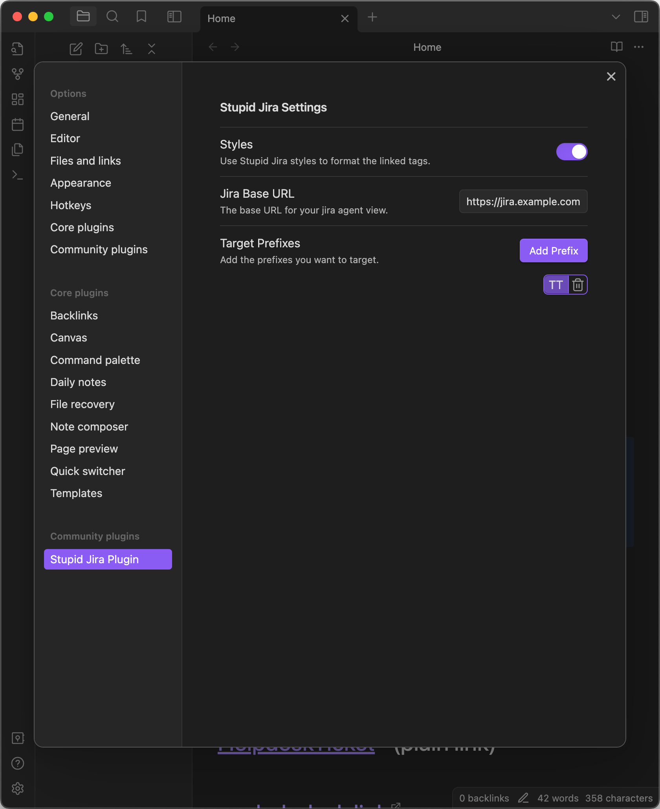

# Stupid Jira Plugin

This is a quick and dirty plugin that lets you mention Jira tickets in your notes, and then get links automatically created that go to your helpdesk. It doesn't use the API or have any kind of smart integration, just good old regex and replace.

I wanted something I could very quickly turn on for my personal notes vault at work, and there are some existing plugins that would integrate well with Jira from what I can see, but I don't actually need that at the moment, and getting the plugin vetted and approved my the security team isn't worth the effort. So enter the **Stupid Jira Plugin**.

# Settings

## Base URL

Set your BaseURL for what you'd want to prefix as your link. Basically go to a ticket on your helpdesk, and copy everything except thge ticket number.

## Prefixes

Add as many Prefixes as you want to include in the matching. No need to include the hyphen at the end.

## Use Styles

If set, this applies some styling to the resulting links, you can disable this if you want plain links. Alternatively you can add your own styles and override the .os80-sjp class in your own CSS.

# Ideas

-   Support multiple cursors
-   Ability to customize per-file with Frontmatter settings
    -   Base URL
    -   Prefixes
    -   Disable SJP
-   Case Insensitivity switch in settings
-   Render in other common plugins
    -   Kanban
-   Associate prefixes to alternate URLs
-   Optional icon for links (Jira logo) or provided by user
-   Handle certain stylings
    -   italics, bold, strikethru,
    -   highlight
    -   Block Quotes

## Known Issues

-   Tags not (always) rendering in Callouts in Live Preview Mode
-   Sometimes tags can act oddly if there are multiple tags, but the earlier tags are not surrounded by whitespace.
-   Tags in Table Headers show up twice in live edit, and are not rendered in live preview.
-   Toggling "Use Styles" in settings requires a refresh to take effect for Reader Mode.

# References

Shoutout to Andrew Zito for their [Obsidian Nice Keyboard Shortcuts](https://github.com/andyzito/obsidian-nice-kbds) plugin and [questions on the Obsidian forum](https://forum.obsidian.md/t/plugin-api-expose-live-edit-functionality-for-extension/73447/7) for asking the questions I forgot to ask months ago for this. Helped me figure out how to make this work in Editor mode and Reader mode! And also to Ryota Ushio for helping Andrew!
